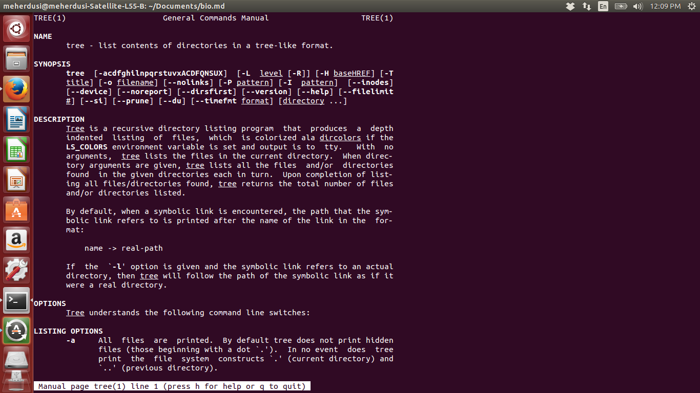
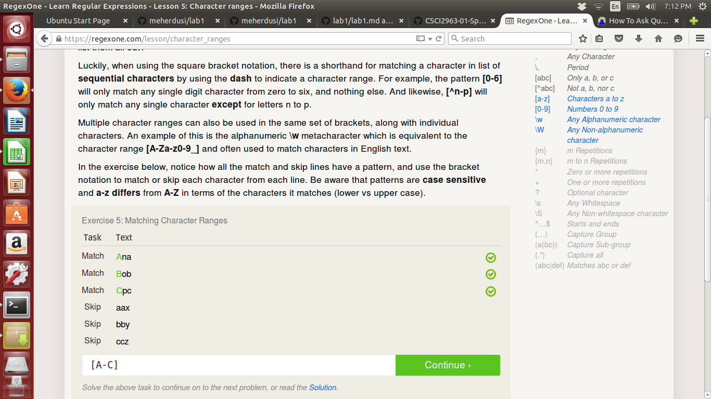

#lab 1

How To Ask Questions The Smart Way:

Suggestions-
 1) Make sure the premise of the question is accurate before 
    making further deductions.
 2) Consult Strunk and White's style guide before writing

Free Culture:

The traumatic experience that Jesse Jordan faced is a failure of both 
science and policy. Punishing technological innovation is unfortunately 
common, dating back to the times of Galileo and Copernicus. Jordan's 
situation was the same; despite his contributions to social progress, he 
was robbed of all his earnings and left penniless. American society is 
known for being incredibly litigious, even in comparison with other 
Western nations. When threatened by the colossus that is the RIAA, it's 
unsurprising that he folded.

The RIAA represents the antithesis of open source principles. Jesse 
endeavored to create a piece of software without any discriminatory 
intent, not distinguishing between methods of use. He neither aided, nor 
harmed pirates. He simply wished to contribute. Freedom to chase 
intellectual pursuits should remain a protected right of society; 
without it the road to stagnation and decay steepens.

Install Tree

Regex problems

Regex Crossword Problems

Blockly problem 10

Project:

I'm interested in electronic medical record keeping. Currently I work 
part time as a medical scribe to assist physicians with this task.
